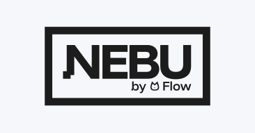
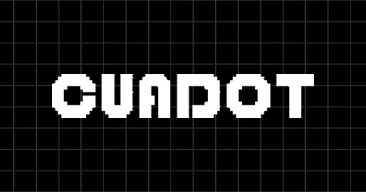

# Johan Amador | Portfolio

Personal portfolio website showcasing my projects, skills, experience, and education as a Software Developer and Computer Science Engineer.

**Live at [cosmodev.me](https://cosmodev.me)**

## Tech Stack

- **Next.js 15** with static export
- **React 19**
- **TypeScript 5**
- **Tailwind CSS 3** with CSS variables theming (dark mode)
- **shadcn/ui** (Radix UI primitives)
- **FontAwesome**, **Lucide React**, **React Icons**
- **Recharts** for GitHub contributions chart
- **Embla Carousel** with autoplay

## Sections

| Section | Description |
|---|---|
| **Hero** | Name, role, featured projects carousel (autoplay), CTA buttons |
| **About** | Bio, languages, GitHub profile card with live stats and contributions chart |
| **Experience** | Timeline with freelance and academic project experience |
| **Projects** | Tabbed grid (Projects / Designs) with modal detail view and live iframe preview |
| **Education** | PUCP, Platzi, Coursera |
| **Skills** | 6 categories: Languages, Frameworks, Tools, Methodologies, Databases, Other |
| **Gallery** | Photo carousel from professional events |
| **Contact** | Contact form via Formspree + social links |

## Featured Projects

<div align="center">
<table>
  <tr>
    <td align="center" width="25%">
      <a href="https://sercomfire.vercel.app/">
        <br/>
        <strong>Grupo Sercom</strong>
      </a>
    </td>
    <td align="center" width="25%">
      <a href="https://prosedain.com/">
        <br/>
        <strong>Prosedain</strong>
      </a>
    </td>
    <td align="center" width="25%">
      <a href="https://farmasaludinversiones.com/">
        <br/>
        <strong>Farmasalud Inversiones</strong>
      </a>
    </td>
    <td align="center" width="25%">
      <a href="https://flow-telligence.com/">
        <br/>
        <strong>Nebu</strong>
      </a>
    </td>
  </tr>
  <tr>
    <td align="center" width="25%">
      <a href="https://mitsperu.com/">
        <br/>
        <strong>MITS Peru</strong>
      </a>
    </td>
    <td align="center" width="25%">
      <a href="https://www.academiapasalo.com/">
        <br/>
        <strong>Academia Pasalo</strong>
      </a>
    </td>
    <td align="center" width="25%">
      <a href="https://www.moraazul.xyz/">
        <br/>
        <strong>Mora</strong>
      </a>
    </td>
    <td align="center" width="25%">
      <a href="https://cuadot.vercel.app/">
        <br/>
        <strong>3D Artist Portfolio</strong>
      </a>
    </td>
  </tr>
</table>
</div>

## Key Features

- Single-page app with smooth scroll navigation
- Project modal with live iframe preview (desktop) and fallback for blocked sites
- Featured projects carousel with autoplay in hero section
- GitHub profile card with live API data (repos, stars, languages, contributions chart)
- Dark mode by default with CSS variables theming
- Fade-in animations via Intersection Observer
- Contact form with Formspree integration
- Fully responsive (mobile sheet drawer, adaptive grids)
- Static export deployed to Namecheap via GitHub Actions

## Getting Started

```bash
# Clone the repo
git clone https://github.com/UltimateCosmic/UltimateCosmic.github.io.git

# Install dependencies
npm install

# Run locally
npm run dev
```

Open [http://localhost:3000](http://localhost:3000) to see the site.

## Deployment

Deployed as a static export (`output: 'export'`) to Namecheap hosting via GitHub Actions. Custom domain configured with CNAME.

## License

This project is MIT licensed.

---

> Built with Next.js 15, React 19, and Tailwind CSS by Johan Amador ([@cosmodev](https://cosmodev.me))
